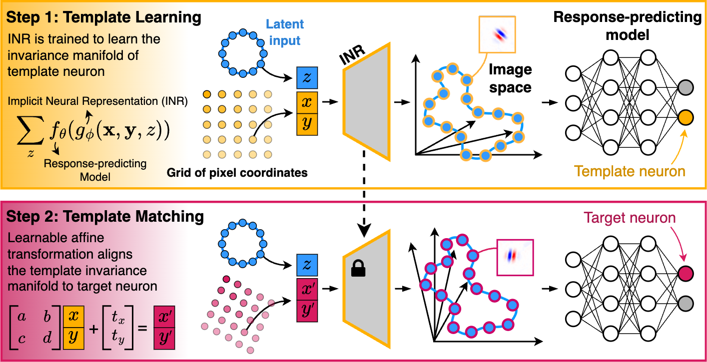

<div align="center">
  
</div>
<br>

**LAMINR** (**L**earning and **A**ligning **M**anifolds of Single-Neuron Invariances using **I**mplicit **N**eural **R**epresentations) enables the **systematic discovery and alignment of invariance manifolds** in stimulus space for visual sensory neurons, providing a principled way to characterize and compare neuronal invariances at the **population level**, independent of nuisance receptive field properties such as position, size, and orientation.

### 🚀 Highlights

- **Continuous Invariance Manifold Learning:** Identifies the full space of stimuli that elicit near-maximal responses from a neuron.
- **Alignment Across Neurons:** Learns transformations that align invariance manifolds across neurons, revealing shared invariance properties.
- **Functional Clustering:** Uncovers distinct functional neuron clusters based on their invariance properties.
- **Model-Agnostic:** Can be applied to any robust response-predicting model of biological neurons.

<div align="center">
  
</div>

## 🛠 Installation

You can install LAMINR using one of the following methods:

### 1️⃣ Using `pip`
```bash
pip install laminr
```

### 2️⃣ Via GitHub (Latest Version)
```bash
pip install git+https://github.com/your-org/laminr.git
```

## 🔥 Quick Start

Here's a simple example of how to use **LAMINR** to learn and align invariance manifolds.

```python
device = "cuda"
input_shape = [1, 100, 100] # channels, height, width

# Load a trained response-predicting model
from laminr import neuron_models
model = neuron_models.simulated("demo1", img_res=input_shape[1:]).to(device)

# Generate MEIs for the neurons
from laminr import get_mei_dict
image_stat_req = {"pixel_value_lower_bound": -1, "pixel_value_upper_bound": 1, "required_img_norm": 1}
meis_dict = get_mei_dict(model, input_shape, **image_stat_req)

# initialize the invariance learning and matching pipeline
from laminr import InvarianceManifold
invariance_manifold = InvarianceManifold(model, meis_dict, **image_stat_req)

# Learn the invariance manifold for neuron 0 (i.e. template manifold)
template_neuron_idx = 0
images_on_template_manifold, template_neuron_activations = invariance_manifold.learn(template_neuron_idx)

# Align the template to neurons 1 and 2
target_neuron_idxs = [1, 2]
images_on_aligned_manifolds, target_neurons_activations = invariance_manifold.match(target_neuron_idxs)
```

## 🛠 Questions & Contributions

If you encounter any issues while using the method, please create an [Issue](https://github.com/sinzlab/laminr/issues) on GitHub.

We welcome and appreciate contributions to the package! Feel free to open an [Issue](https://github.com/sinzlab/laminr/issues) or submit a [Pull Request](https://github.com/sinzlab/laminr/pulls) for new features.

For other questions or project collaboration inquiries, please contact mohammadbashiri93@gmail.com or loocabaroni@gmail.com.

## 📜 License

This package is licensed under the **Creative Commons Attribution-NonCommercial 4.0 International (CC BY-NC 4.0) License**. Briefly:
- **Attribution Required**: You must credit the original authors and indicate if changes were made.
- **NonCommercial Use Only**: This package may not be used for commercial purposes without explicit permission.
- **No Additional Restrictions**: You may not apply legal terms that prevent others from using this package under these terms.

For full details, see the [CC BY-NC 4.0 License](https://creativecommons.org/licenses/by-nc/4.0/).<br>
For commercial use inquiries, please contact: mohammadbashiri93@gmail.com.

## 📖 Paper

**ICLR 2025** (\<PRESENTATION FORMAT\>): [Learning and Aligning Single-Neuron Invariance Manifolds in Visual Cortex](https://openreview.net/forum?id=kbjJ9ZOakb) <br>
**Authors**: Mohammad Bashiri*, Luca Baroni*, Ján Antolík, Fabian H. Sinz. (* denotes equal contribution)

Please cite our work if you find it useful:

```bibtex
@inproceedings{bashiri2025laminr,
  title={Learning and Aligning Single-Neuron Invariance Manifolds in Visual Cortex},
  author={Bashiri, Mohammad and Baroni, Luca and Antolík, Ján and Sinz, Fabian H.},
  booktitle={International Conference on Learning Representations (ICLR)},
  year={2025}
}
```
